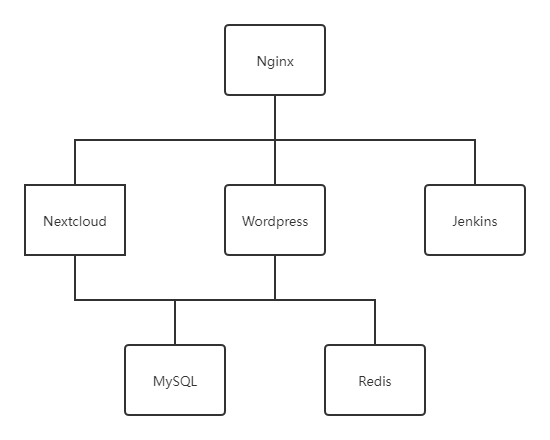

# Satellite Blueprint

> Satellite Blueprint is a docker compose project for private server maintained by SolitudeRA.

[](https://www.protogalaxy.me)
[](https://choosealicense.com/licenses/mit/)


---

## Quick Start

###Clone project from GitHub 

To deploy Satellite Blueprint, you may first clone this project from GitHub to your own server by running this command.

```
git clone https://github.com/SolitudeRA/Satellite-blueprint.git
```

After cloning and before deploying the project, you should first ***install Pre-Depends*** and ***modify sensitive
config*** of the docker compose file and database initializing files.

###Install Pre-Depends

Here is the command to install Pre-Depends of the project.

```
sudo apt-get install jq
```

###Modify sensitive config

After installing Pre-Depends, you can modify sensitive config in ***config.json*** 

###Deploy sensitive config

You can deploy sensitive config by running this script.

```
/scripts/deploy/deploy_config.sh
```

###Modify proxy config

You should modify nginx server blocks of the services to make the 

```
/blueprint/proxy/nginx/server_blocks
```

###Deploy the project

You could run this command in project directory to deploy the project.

```
docker-compose up -d
```

## User Guide

### Architecture

